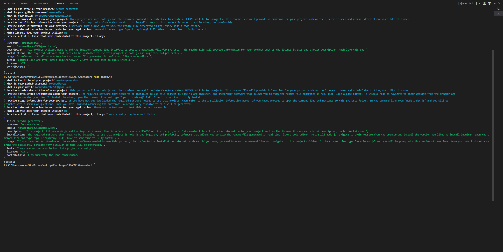
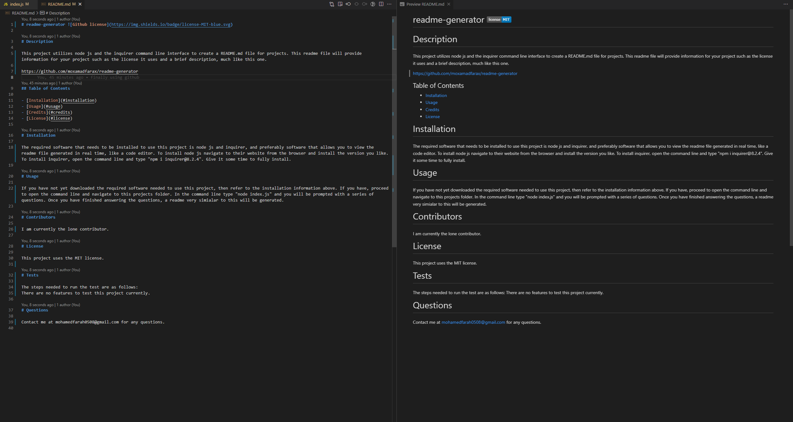

# readme-generator 

# Description

This project utilizes node js and the inquirer command line interface to create a README.md file for projects. This readme file will provide information for your project such as the license it uses and a brief description, much like this one.

https://github.com/moxamadfarax/readme-generator

- This is a screenshot of the comamand line prompts given.

  

- This is a screenshot of what is generated.

  

## Table of Contents

- [Installation](#installation)
- [Usage](#usage)
- [Credits](#credits)
- [License](#license)

# Installation

The required software that needs to be installed to use this project is node js and inquirer, and preferably software that allows you to view the readme file generated in real time, like a code editor. To install node js navigate to their website from the browser and install the version you like. To install inquirer, open the command line and type "npm i inquirer@8.2.4". Give it some time to fully install.

# Usage

If you have not yet downloaded the required software needed to use this project, then refer to the installation information above. If you have, proceed to open the command line and navigate to this projects folder. In the command line type "node index.js" and you will be prompted with a series of questions. Once you have finished answering the questions, a readme very simialar to this will be generated.

# Contributors

I am currently the lone contributor.

# License

This project uses the MIT license.

# Tests

The steps needed to run the test are as follows:
There are no features to test this project currently.

# Questions

Contact me at mohamedfarah0508@gmail.com for any questions.
